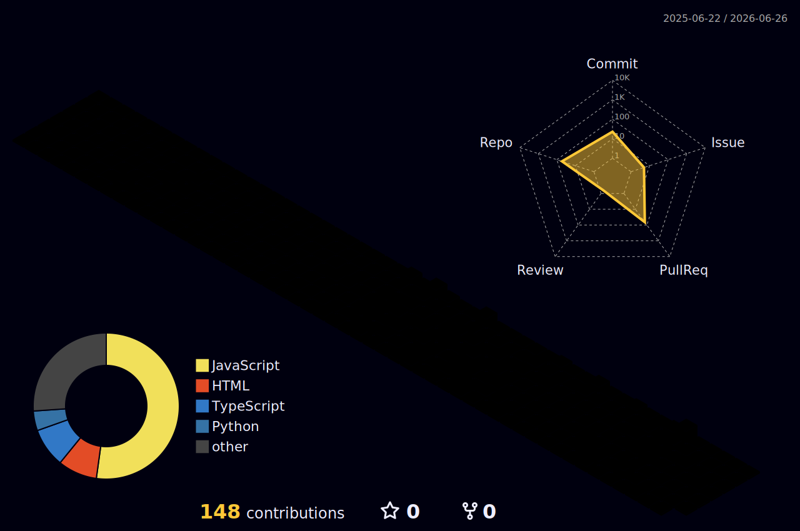

# Hey there, I'm Vivek Yadav 👋

### Full-Stack Developer | Open Source Enthusiast | GSoC '26 Contributor

  

<table border="0">
  <tr>
    <td width="50%" valign="top">
      <h3>👨‍💻 About Me</h3>
      <ul>
        <li><b>Name:</b> Vivek Yadav</li>
        <li><b>Role:</b> Full-Stack Engineer</li>
        <li><b>University:</b> KIIT University</li>
        <li><b>Current Focus:</b> Improving @RocketChat's EmbeddedChat</li>
      </ul>
      

        🌱 Diving deep into <b>System Design & Advanced React Patterns</b>. 
        🚀 Passionate about building scalable, high-performance web applications. 
        🎯 Aiming to revolutionize <b>EmbeddedChat</b> at Rocket.Chat. 
        📫 Let's connect: <b>[vivekyadav-3](https://github.com/vivekyadav-3)</b>
      

    </td>
    <td width="50%" valign="top">
      <h3>📊 GitHub Stats</h3>
      
       
      
    </td>
  </tr>
</table>

---

### 🧊 3D Contribution Calendar

  

---

### ⚡ GitHub Metrics & Radar Chart

  

---

### 🚀 Experience Highlights

<table border="0">
  <tr>
    <td width="33%" valign="top">
      <h4>🏢 Rocket.Chat</h4>
      <b>GSoC '26 Contributor • Feb 2026 - Present</b>
      <ul>
        <li>Spearheaded <b>Holistic Stability Overhaul</b> (#1163) for EmbeddedChat.</li>
        <li>Optimized <code>MessageAggregator</code> rendering and consolidated auth listeners.</li>
      </ul>
    </td>
    <td width="33%" valign="top">
      <h4>🏢 CircuitVerse</h4>
      <b>OSS Contributor • Jan 2026 - Feb 2026</b>
      <ul>
        <li>Fixed critical <b>Heatmap Drift</b> and timezone mapping issues.</li>
        <li>Improved accuracy of global contributor activity tracking.</li>
      </ul>
    </td>
    <td width="33%" valign="top">
      <h4>🏢 Personal Projects</h4>
      <b>Full-Stack Developer • 2025 - Present</b>
      <ul>
        <li><b>RootCode:</b> A full-fledged code execution engine with Judge integration.</li>
        <li><b>EcoCart:</b> Modern MERN stack e-commerce with performance optimizations.</li>
      </ul>
    </td>
  </tr>
</table>

---

### 🛠 Tech Stack

  

---

### 🌐 Open Source Activity

  

---

### 🌟 Featured Project: [EmbeddedChat](https://github.com/RocketChat/EmbeddedChat)

  

  Actively improving the core reliability and UX of Rocket.Chat's lightweight chat widget. Focus areas: Authentication FSM, performance optimization, and feature parity.

---

  

